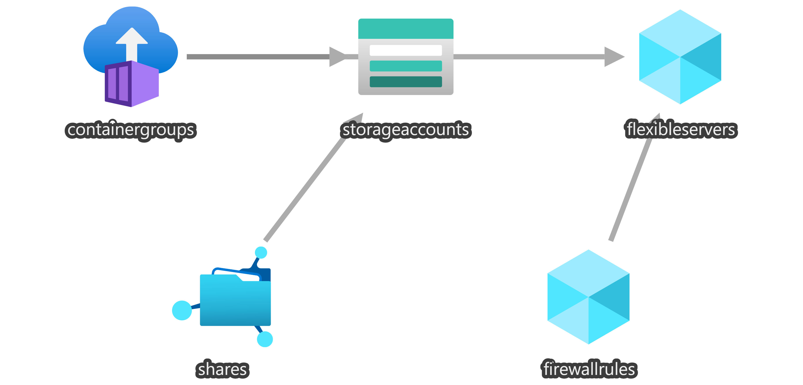

# XNAT on Azure Deployment

The `1_Deployment` directory contains scripts and templates to deploy XNAT on Azure. 

The `docker` directory contains dockerfile and other scripts to build XNAT container with the OHIF plugin. It also contains a `docker-compose.yaml` file to run the setup locally for testing.

The `arm` directory contains ARM templates for deploying XNAT on Azure and leveraging Azure managed services like:
- Azure Container Instance
- Azure PostgresSQL
- Azure FileShare

to deploy xnat.



# How to Deploy

### 1. Build docker image
```
docker build -t <your_docker_image_name> .
```

### 2. Publish docker image to a registry
```
docker push <your_docker_image>
```
### 3. Deploy ARM temlate
```
az deployment group create --resource-group <your_resource_group> --template-file .\arm\xnat.json --parameters administratorLogin=<your_sql_user> administratorLoginPassword=<your_sql_password> acrName=<your_azure_container_registry> acrPassword=<your_acr_password> acrUsername=<your_acr_username> acrDockerImage=<docker_image_pushed_in_step_2>
```