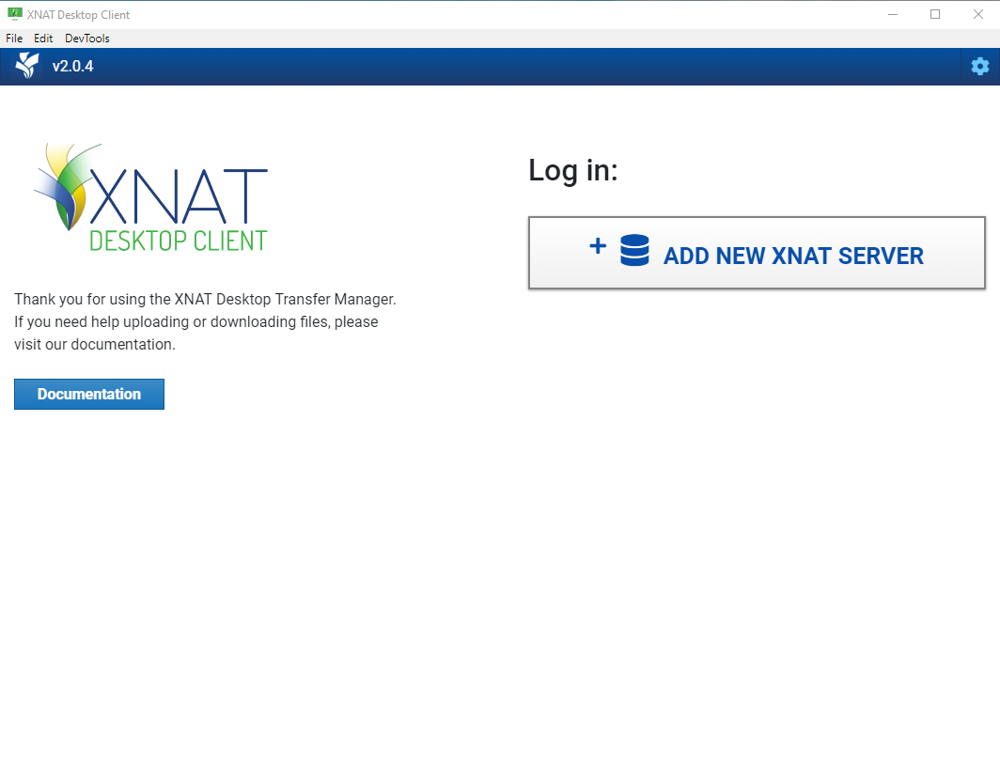
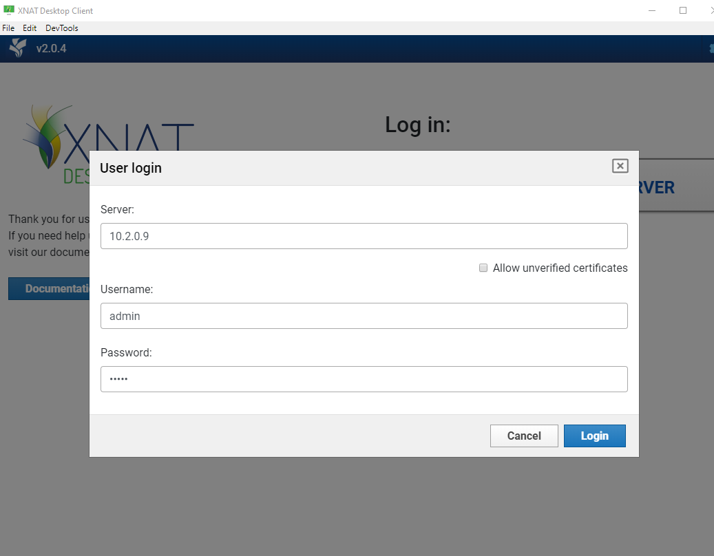
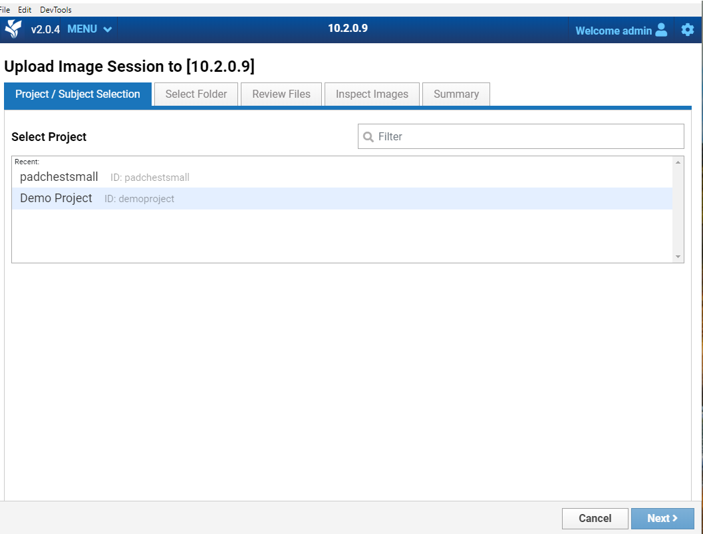
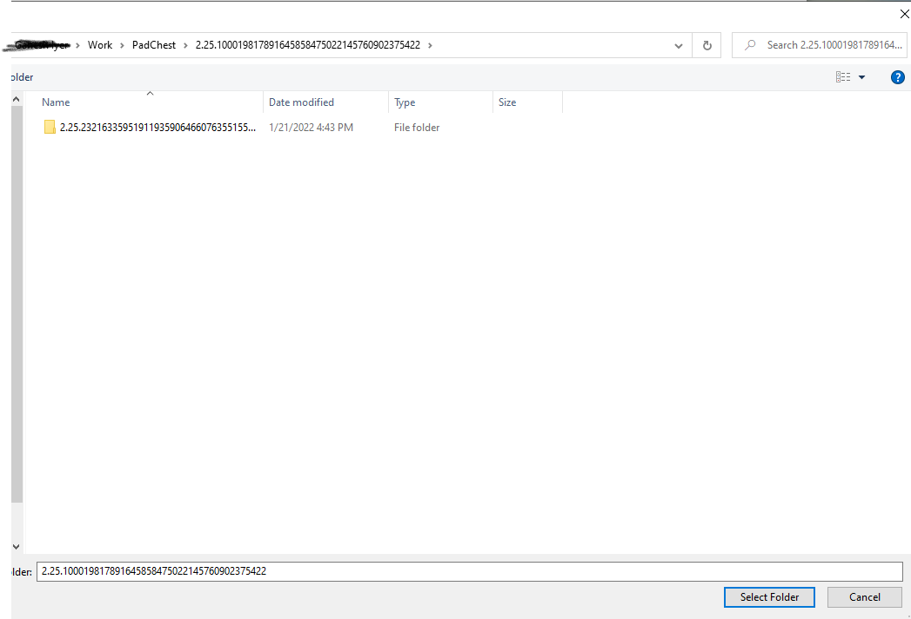
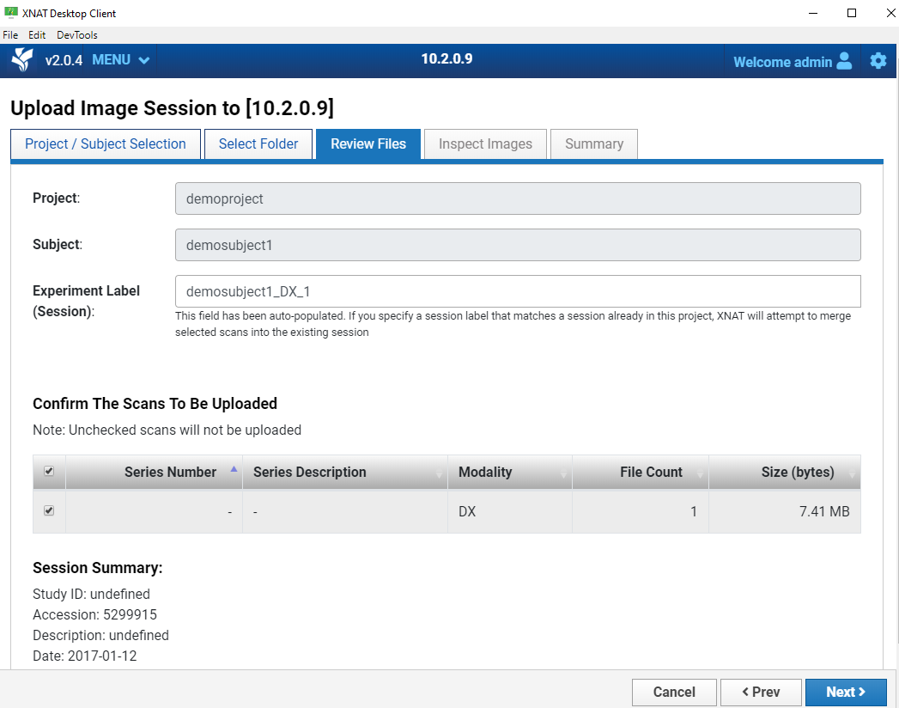
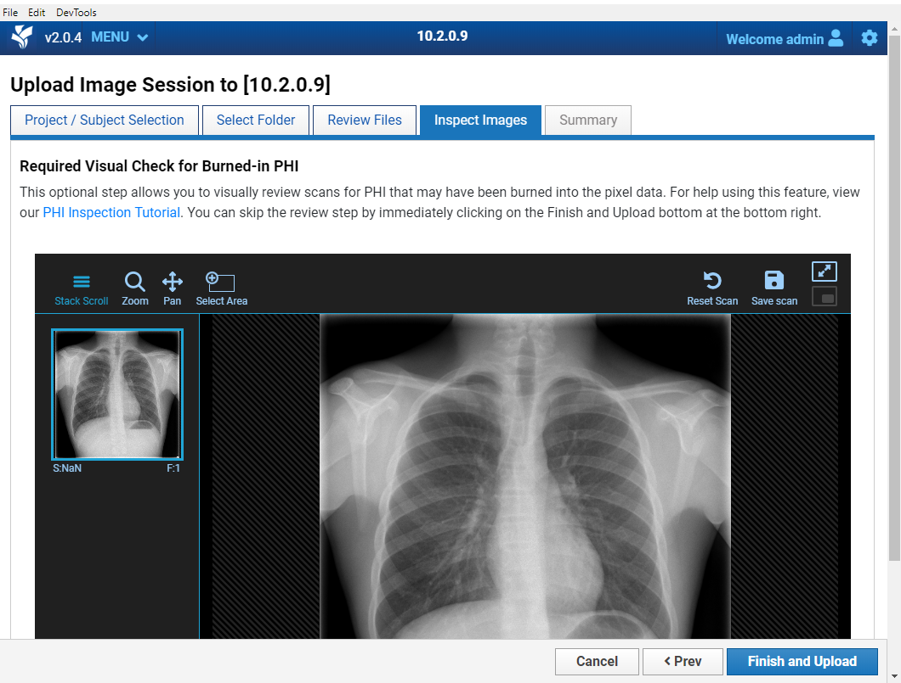

# Upload DICOMs Using XNAT desktop Client

The XNAT desktop client is a GUI application which lets users interact with the XNAT server ([Download Link](https://download.xnat.org/desktop-client/)). We'll be using XNAT desktop client to connect to our XNAT server and upload DICOM images from local hard disk.

1. Open XNAT Desktop Client

2. Click the "Add New XNAT Server" and fill in details of your XNAT server. For this tutorial we're connecting to XNAT server deployed on `10.2.0.9`

3. Once you've successfully logged in you should see the following screen:

4. Click "Upload files" button and select the desired project. For this tutorial we're using "Demo Project" as our project. You'll then be prompted to select an existing subject or to create a new subject.

5. Click next and then select the folder from your disk where the DICOM files are stored

6. Review the files that were uploaded

7. The XNAT desktop client also comes with an embedded DICOM viewer to visually inspect the images to make sure there's no PHI in the pixel data.

8. Click "Finish and Upload" and the images should be uploaded to the project
