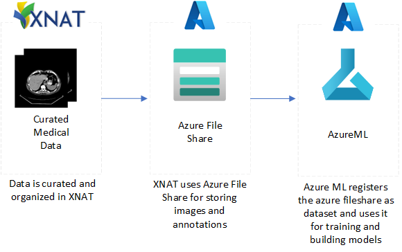
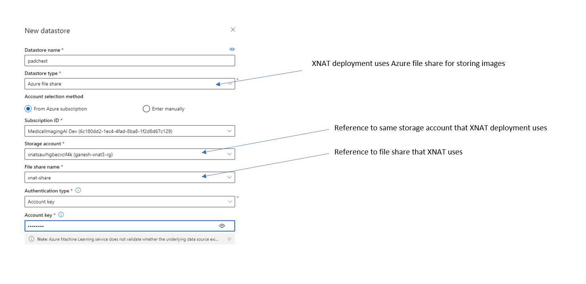
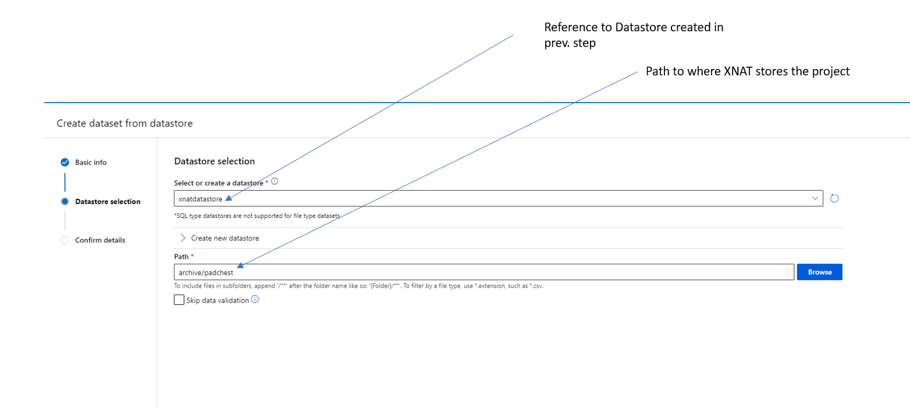

# Using XNAT Project as an AzureML Dataset

AzureML uses datasets for exploring, transforming and managing data in AzureML. [AzureML Dataset docs](https://docs.microsoft.com/en-us/python/api/azureml-core/azureml.core.dataset.dataset?view=azure-ml-py)

It supports Tabular and Filedataset. To use data in the XNAT projects we will use XNAT's directory structure to create a FileDataset. [AzureML Filedataset docs](https://docs.microsoft.com/en-us/python/api/azureml-core/azureml.data.filedataset?view=azure-ml-py)

### Idea
In our deployment the XNAT container writes images to an Azure Fileshare. We use the same fileshare to create an AzureML Datastore and and AzureML Dataset 



### Linking XNAT as AzureML Datastore
[AzureML Datastore docs](https://docs.microsoft.com/en-us/python/api/azureml-core/azureml.core.datastore.datastore?view=azure-ml-py)

In Azure ML Studio > Datastores > New Datastore

Here we create a datastore referencing the same file share that the XNAT deployment uess.

### Liking XNAT Project as AzureML Dataset
[AzureML Dataset docs](https://docs.microsoft.com/en-us/python/api/azureml-core/azureml.core.dataset.dataset?view=azure-ml-py)


Here we provide the path to the project, make sure to check "Skip data validation".

### Restricting access
[Manage access to an Azure Machine Learning Worksapce](https://docs.microsoft.com/en-us/azure/machine-learning/how-to-assign-roles) provides details on how to use Azure role-based access control to grant access to resources. 

Following is an example of a custom role that might be used to restrict access to other datasets.

```
{
    "Name": "Data Scientist for Project",
    "IsCustom": true,
    "Description": "Can run experiment only on PadChest project",
    "Actions": ["*"],
    "NotActions": [
        "Microsoft.MachineLearningServices/workspaces/*/delete",
        "Microsoft.MachineLearningServices/workspaces/write",
        "Microsoft.MachineLearningServices/workspaces/datasets/*/write",
        "Microsoft.MachineLearningServices/workspaces/datasets/*/delete", 
        "Microsoft.Authorization/*/write"
    ],
    "AssignableScopes": [
        "/subscriptions/<subscription_id>/resourceGroups/<resource_group_name>/providers/Microsoft.MachineLearningServices/workspaces/<workspace_name>"
    ]
}
```

This custom role can do everything in the workspace except:
- can't delete the workspace
- can't create or update datasets
- can't add, delete or alter role assignments

Note: This is just a poc. We may need finer grain control based on feedback from users.

Now this user can't access create any other datasets that are not part of the workspace.


# Training ML Models

Once an XNAT project is registered as an Azure ML dataset. The [training.ipynb](training.ipynb) notebook provides an example on how to train an ML model using images stored in XNAT.